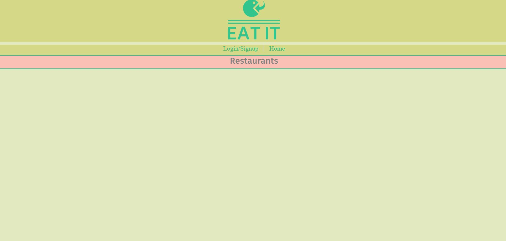

# Eat-It
Food ordering/tracker app.

## Description
Main Topic: MERN

Typical MERN stack that allows users to view a dashboard with a list of restaurants. App allows user to login and save/order from the list of restaurants to use later and also certain users can login with admin permissions and change restaurant and menu data. This app use graphQL and apollo server to fetch and manipulate data instead of being a RESTFUL API. This app also utilizes JWT to authenicate user login.

## Installation
1. Fork Repo
2. In root
   1. Run `npm i`
   2. Run `npm run seed` to seed database
   3. Run `npm run develop` to start app


## Screenshot



## Heroku Link
[Click here](https://eatit-5de928edb7f4.herokuapp.com/)


## Developed by:
```
Robert Figgers
John Foxwell
Allison Tune
```
